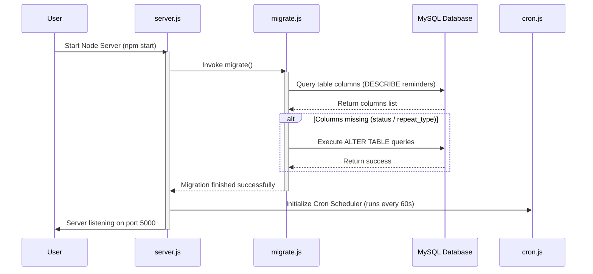
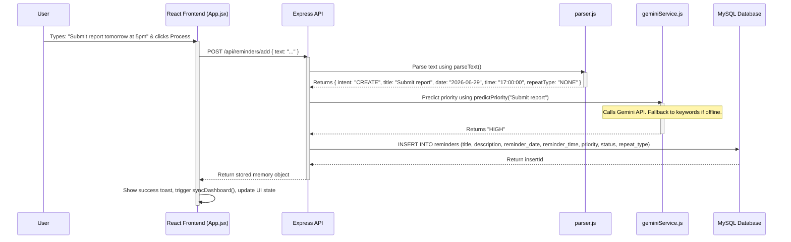
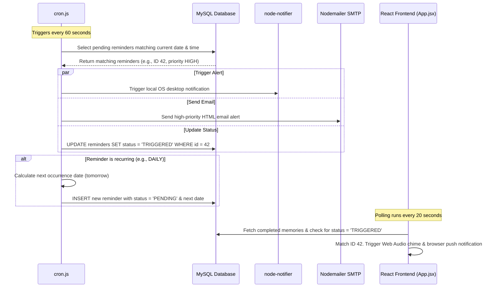
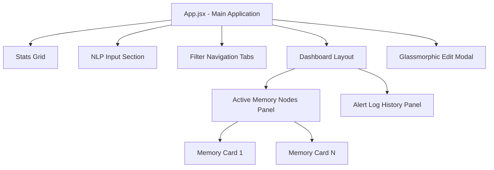
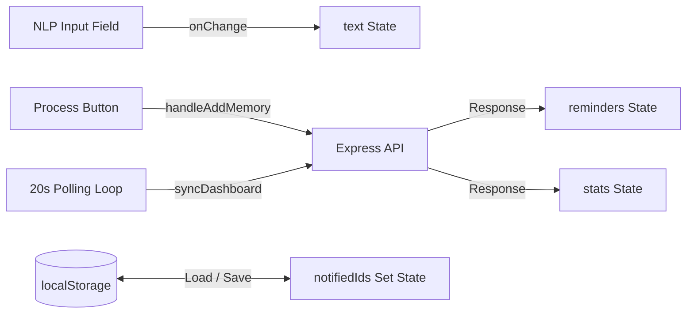
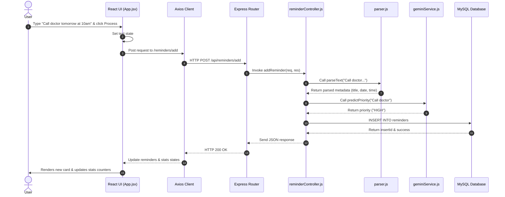

# 🧠 NLP-Driven Personal Memory Assistant with Real-Time Alerts
## Technical Handbook & Project Documentation

This handbook serves as a comprehensive technical guide for the **NLP-Driven Personal Memory Assistant with Real-Time Alerts**. It details the architecture, file-by-file implementation, data flows, database schemas, and contains interview preparation materials based on the actual codebase.

---

## 1. Project Overview

### Project Objective
The **NLP-Driven Personal Memory Assistant** is designed to act as an external cognitive extension. It allows users to store, organize, and retrieve personal memories, tasks, and reminders using natural language. The system automatically extracts scheduling metadata (dates, times, recurrence) from conversational inputs, classifies task priority using generative AI, and triggers real-time desktop and email alerts.

### Problem Being Solved
Human memory is fallible, and traditional task managers require tedious manual input (clicking dropdowns, selecting dates, picking times). This friction leads to low adoption. The Personal Memory Assistant solves this by:
1. **Reducing Friction:** Converting unstructured natural language (e.g., *"remind me to call Mom tomorrow at 6 PM"*) into structured database records.
2. **Context-Aware Prioritization:** Automatically determining if a task is urgent or normal using AI, without requiring the user to manually set a priority.
3. **Proactive Alerting:** Bridging the gap between passive storage and active recall by using local cron schedulers, desktop notifications, and email alerts.

### Real-World Use Case
* **Cognitive Support:** Helping individuals with ADHD or mild cognitive impairment stay on top of daily routines.
* **Professional Productivity:** Allowing busy professionals to quickly type or dictate tasks during meetings and have them parsed and scheduled instantly.
* **Daily Assistant:** Managing recurring tasks (e.g., *"pay utility bill every month at 10 AM"*) and receiving multi-channel notifications.

### Target Users
* Individuals seeking a low-friction productivity tool.
* Users who prefer conversational interfaces over complex form-based UIs.
* People who require multi-channel alerts (desktop sound + visual notification + email) to ensure critical tasks are not missed.

### Core Features
* **Conversational NLP Parsing:** Custom rule-based parser extracting title, date, time, and recurrence from natural language.
* **Conversational Querying:** Switching display filters based on natural language commands (e.g., *"show high priority reminders"*).
* **AI Priority Classification:** Integrating Google Gemini 1.5 Flash to classify task priority, with a local keyword-based fallback.
* **Real-Time Cron Engine:** Background worker checking for events every 60 seconds, triggering native OS notifications and updating status.
* **Multi-Channel Alerts:** Synthesized Web Audio chimes, OS desktop alerts (`node-notifier`), and responsive HTML email alerts (`nodemailer`).
* **Recurrence Engine:** Automatic rescheduling of daily, weekly, and monthly events.
* **Overdue Management:** Automatically marking outdated pending tasks as `MISSED`.

### Technology Stack
* **Frontend:** React (Vite), Axios, HTML5 Web Audio API, HTML5 Notification API, CSS3.
* **Backend:** Node.js, Express.js.
* **Database:** MySQL (using `mysql2` driver).
* **AI Layer:** Google Gemini API (`@google/generative-ai` SDK).
* **Services & Utilities:** `node-cron` (scheduling), `nodemailer` (SMTP email), `node-notifier` (OS desktop alerts).

### Future Improvements
* **Multi-User Authentication:** Adding JWT-based sessions and user-specific database scoping.
* **Voice Input Integration:** Integrating the Web Speech API for hands-free memory capture.
* **Vector Search & RAG:** Using embeddings to search memories semantically instead of relying on keyword matching.
* **Mobile Responsiveness & PWA:** Adding service workers for offline capability and mobile push notifications.

---

## 2. Overall Architecture

The application follows a classic **Three-Tier Client-Server Architecture** augmented with an **AI service layer** and a **background job scheduler**.

### Architecture Diagram

```mermaid
graph TD
    subgraph Client Tier (Frontend)
        A[React SPA - Vite] -->|Web Audio API| B[Audio Chime]
        A -->|Notification API| C[Browser Push Notification]
        A -->|Axios HTTP Requests| D[Express REST API]
    end

    subgraph Application Tier (Backend)
        D -->|Routes / Controllers| E[Memory & Reminder Controllers]
        E -->|NLP Parser| F[parser.js]
        E -->|AI Client SDK| G[Gemini 1.5 Flash API]
        H[node-cron Scheduler] -->|Every 60s| I[Cron Engine]
        I -->|Desktop Alert| J[node-notifier]
        I -->|HTML Email Service| K[Nodemailer SMTP]
    end

    subgraph Database Tier
        E -->|SQL Queries| L[(MySQL Database)]
        I -->|State Updates| L
    end

    classDef orange fill:#f96,stroke:#333,stroke-width:2px;
    classDef blue fill:#9cf,stroke:#333,stroke-width:2px;
    classDef green fill:#9f9,stroke:#333,stroke-width:2px;
    class A,D,L orange;
    class F,G,I blue;
    class B,C,J,K,H green;
```

### Communication Flow
1. **HTTP REST API:** The React frontend communicates with the Express backend using JSON payloads over HTTP.
2. **AI Integration:** The backend communicates with Google's Gemini servers via HTTPS using the official `@google/generative-ai` SDK.
3. **Database Client:** The backend maintains a persistent TCP connection to the MySQL database via the `mysql2` driver.
4. **SMTP Protocol:** Nodemailer establishes a secure TLS connection to Gmail SMTP servers to dispatch emails.
5. **IPC (Inter-Process Communication):** The backend uses `node-notifier` which spawns native platform binaries to trigger OS-level notifications.

### Architectural Design Decisions & Rationale
* **Why Monolithic Backend?** Given the tight integration between the API endpoints and the cron scheduler, a unified Node.js process simplifies deployment and shared database access.
* **Why Custom Rule-Based NLP Parser?** To avoid the overhead and latency of external NLP APIs for deterministic date/time phrases, and to ensure offline-capable parsing.
* **Why Hybrid Priority Prediction?** Gemini API is used for semantic understanding of task urgency, but a local keyword fallback ensures the application remains functional even if the network is down or API keys are missing.
* **Why Background Polling?** The frontend polls the backend every 20 seconds to synchronize statistics and trigger browser notifications. This provides a near real-time experience without the complexity of WebSockets.

---

## 3. Folder Structure

### Folder Tree
```text
NLP-Driven Personal Memory Assistant with Real-Time Alerts/
├── backend/
│   ├── config/
│   │   ├── db.js             # Database connection configuration
│   │   ├── migrate.js        # Database migration runner
│   │   └── schema.sql        # Database schema definition
│   ├── controllers/
│   │   ├── memoryController.js   # Memory retrieval & stats logic
│   │   └── reminderController.js # CRUD & NLP memory insertion logic
│   ├── routes/
│   │   ├── memoryRoutes.js   # Express routes for memory retrieval
│   │   └── reminderRoutes.js # Express routes for CRUD operations
│   ├── services/
│   │   └── geminiService.js  # Gemini AI priority prediction service
│   ├── utils/
│   │   ├── cron.js           # Background scheduler & recurrence engine
│   │   ├── email.js          # SMTP Nodemailer HTML email service
│   │   └── parser.js         # Custom NLP rule-based text parser
│   ├── .env                  # Backend environment variables
│   ├── .gitignore            # Git ignore rules for backend
│   ├── package.json          # Node.js backend dependencies
│   └── server.js             # Express application entry point
├── frontend/
│   ├── public/               # Static assets
│   ├── src/
│   │   ├── assets/           # React image/icon assets
│   │   ├── App.css           # Custom CSS variables and styles
│   │   ├── App.jsx           # Main React App component & state coordinator
│   │   ├── index.css         # Global resets and scrollbar styles
│   │   └── main.jsx          # React DOM entry point
│   ├── .gitignore            # Git ignore rules for frontend
│   ├── eslint.config.js      # ESLint configuration
│   ├── index.html            # HTML shell
│   ├── package.json          # Frontend dependencies
│   └── vite.config.js        # Vite configuration
├── README.md                 # Technical Handbook (This File)
└── implementation_plan.md    # Original project upgrade plan
```

### Folder Responsibilities & Communication
* **`backend/config/`**: Responsible for data persistence setup. It initializes the database client and ensures the table schema is up to date before the server starts listening.
* **`backend/controllers/`**: The orchestration layer. It receives parsed requests from routes, interacts with services (Gemini) and utilities (NLP Parser), queries the database, and returns HTTP responses.
* **`backend/routes/`**: Exposes specific HTTP endpoints and maps them to controller actions.
* **`backend/services/`**: Handles integrations with external APIs (Google Gemini).
* **`backend/utils/`**: Houses independent utility modules. `parser.js` has zero dependencies and is fully testable. `cron.js` runs independently in the background. `email.js` handles SMTP operations.
* **`frontend/src/`**: Manages the user interface. `App.jsx` handles state management, UI rendering, client-side polling, Web Audio synthesis, and browser push notifications.

---

## 4. File-by-File Explanation

### Backend Files

#### 1. [server.js](file:///c:/Users/mugil/Desktop/Projects/Resume%20Projects/NLP-Driven%20Personal%20Memory%20Assistant%20with%20Real-Time%20Alerts/backend/server.js)
* **Purpose:** Entry point for the backend application.
* **Imports:** `express`, `cors`, `./config/migrate`, `./routes/reminderRoutes`, `./routes/memoryRoutes`, `./utils/cron`.
* **Business Logic:** Initializes the Express app, registers CORS and JSON parsing middlewares, mounts `/api/reminders` and `/api/memory` routes, and imports the cron scheduler.
* **Startup Sequence:** Runs the database migration script (`migrate()`). If successful, it boots the server on port `5000`. If migrations fail, it logs the error and boots the server anyway to maintain availability.

#### 2. [config/db.js](file:///c:/Users/mugil/Desktop/Projects/Resume%20Projects/NLP-Driven%20Personal%20Memory%20Assistant%20with%20Real-Time%20Alerts/backend/config/db.js)
* **Purpose:** Configures and establishes the MySQL connection.
* **Imports:** `dotenv` (loaded via `.config()`), `mysql2`.
* **Exports:** `db` connection object.
* **Design Note:** Uses `mysql.createConnection` to open a single persistent TCP connection. While sufficient for a single-user local app, a production-scale application should use `mysql.createPool` to manage concurrent connections.

#### 3. [config/migrate.js](file:///c:/Users/mugil/Desktop/Projects/Resume%20Projects/NLP-Driven%20Personal%20Memory%20Assistant%20with%20Real-Time%20Alerts/backend/config/migrate.js)
* **Purpose:** Performs schema migrations dynamically on startup.
* **Imports:** `./db`.
* **Mechanism:** Queries `DESCRIBE reminders` to fetch existing columns. If `status` or `repeat_type` are missing, it queues `ALTER TABLE` statements. It executes these queries sequentially using a promise chain, ensuring the database is updated without data loss.

#### 4. [config/schema.sql](file:///c:/Users/mugil/Desktop/Projects/Resume%20Projects/NLP-Driven%20Personal%20Memory%20Assistant%20with%20Real-Time%20Alerts/backend/config/schema.sql)
* **Purpose:** Defines the SQL schema.
* **Tables:** Creates the `reminders` table with columns: `id` (PK), `title`, `description` (holds full input text), `reminder_date` (DATE), `reminder_time` (TIME), `priority` (VARCHAR), `status` (ENUM: PENDING, TRIGGERED, MISSED), `repeat_type` (ENUM: NONE, DAILY, WEEKLY, MONTHLY), and `created_at`.

#### 5. [controllers/memoryController.js](file:///c:/Users/mugil/Desktop/Projects/Resume%20Projects/NLP-Driven%20Personal%20Memory%20Assistant%20with%20Real-Time%20Alerts/backend/controllers/memoryController.js)
* **Purpose:** Implements memory retrieval filters and aggregates statistics.
* **Key Functions:**
  * `getLocalDateStrings()`: Returns local date/time strings (`YYYY-MM-DD` and `HH:MM:SS`) to prevent server-client timezone mismatch issues.
  * `getTodayMemories()`: Queries reminders scheduled for today.
  * `getWeekMemories()`: Queries reminders scheduled between today and today + 6 days.
  * `getHighPriorityMemories()`: Queries reminders where `priority = 'HIGH'`.
  * `getUpcomingMemories()`: Queries pending reminders scheduled for today or in the future.
  * `getCompletedMemories()`: Queries triggered reminders.
  * `getMemoryStats()`: Computes total, pending, triggered, missed, and high-priority counts in a single optimized query using conditional aggregation (`SUM(CASE WHEN...)`).

#### 6. [controllers/reminderController.js](file:///c:/Users/mugil/Desktop/Projects/Resume%20Projects/NLP-Driven%20Personal%20Memory%20Assistant%20with%20Real-Time%20Alerts/backend/controllers/reminderController.js)
* **Purpose:** Manages CRUD operations and coordinates natural language processing.
* **Business Logic (`addReminder`):**
  * Parses input text using the local NLP engine.
  * If a **RETRIEVE** intent is detected, it queries the database and returns the list of matching reminders immediately.
  * If a **CREATE** intent is detected, it calls `predictPriority()` (Gemini), inserts a new reminder into the database, and returns the newly created record.
* **Other Actions:** `getReminders()` (returns all), `deleteReminder()`, and `updateReminder()` (constructs dynamic `UPDATE` statements for partial modifications).

#### 7. [routes/memoryRoutes.js](file:///c:/Users/mugil%5CDesktop%5CProjects%5CResume%20Projects%5CNLP-Driven%20Personal%20Memory%20Assistant%20with%20Real-Time%20Alerts/backend/routes/memoryRoutes.js) & [routes/reminderRoutes.js](file:///c:/Users/mugil%5CDesktop%5CProjects%5CResume%20Projects%5CNLP-Driven%20Personal%20Memory%20Assistant%20with%20Real-Time%20Alerts/backend/routes/reminderRoutes.js)
* **Purpose:** Define Express routers. Map routes like `GET /today`, `POST /add`, `DELETE /:id`, and `PUT /:id` to their respective controller methods.

#### 8. [services/geminiService.js](file:///c:/Users/mugil/Desktop/Projects/Resume%20Projects/NLP-Driven%20Personal%20Memory%20Assistant%20with%20Real-Time%20Alerts/backend/services/geminiService.js)
* **Purpose:** AI priority classification.
* **Imports:** `@google/generative-ai`.
* **Business Logic:** If `GEMINI_API_KEY` is present, it initializes the `gemini-1.5-flash` model and prompts it to classify the task title as `LOW`, `NORMAL`, or `HIGH`. It includes strict constraints to return only the single classification word. If the API key is missing, or the call fails, it falls back to local keyword matching.

#### 9. [utils/cron.js](file:///c:/Users/mugil/Desktop/Projects/Resume%20Projects/NLP-Driven%20Personal%20Memory%20Assistant%20with%20Real-Time%20Alerts/backend/utils/cron.js)
* **Purpose:** Runs background scheduling and manages recurrence.
* **Imports:** `node-cron`, `./email`, `node-notifier`.
* **Execution:** Runs every 60 seconds (`* * * * *`).
  * **Step 1 (Triggering):** Finds pending reminders scheduled for the current minute. Triggers desktop alerts, marks them as `TRIGGERED`, sends emails for `HIGH` priority tasks, and schedules the next occurrence if they are recurring.
  * **Step 2 (Missed):** Finds pending reminders whose scheduled time is in the past. Marks them as `MISSED` and schedules their next occurrence if they are recurring.

#### 10. [utils/email.js](file:///c:/Users/mugil/Desktop/Projects/Resume%20Projects/NLP-Driven%20Personal%20Memory%20Assistant%20with%20Real-Time%20Alerts/backend/utils/email.js)
* **Purpose:** Dispatches SMTP email notifications.
* **Imports:** `nodemailer`.
* **Business Logic:** Establishes a Gmail SMTP transport using environment variables. `sendHighPriorityEmail()` formats dates and times, inserts them into a responsive HTML email template with inline styles, and sends the email.

#### 11. [utils/parser.js](file:///c:/Users/mugil/Desktop/Projects/Resume%20Projects/NLP-Driven%20Personal%20Memory%20Assistant%20with%20Real-Time%20Alerts/backend/utils/parser.js)
* **Purpose:** Pure rule-based NLP parser.
* **Business Logic:** Cleans text, tokenizes, detects intent (CREATE vs RETRIEVE), extracts date phrases (e.g., *tomorrow*, *next Friday*), extracts time phrases (AM/PM or 24h), detects recurrence rules, and removes filler words to isolate a clean task title.

---

### Frontend Files

#### 12. [src/main.jsx](file:///c:/Users/mugil/Desktop/Projects/Resume%20Projects/NLP-Driven%20Personal%20Memory%20Assistant%20with%20Real-Time%20Alerts/frontend/src/main.jsx)
* **Purpose:** React application bootstrapper. Mounts the `<App />` component in the HTML DOM element with ID `root` under `React.StrictMode`.

#### 13. [src/App.jsx](file:///c:/Users/mugil/Desktop/Projects/Resume%20Projects/NLP-Driven%20Personal%20Memory%20Assistant%20with%20Real-Time%20Alerts/frontend/src/App.jsx)
* **Purpose:** Main React component containing all frontend state, business logic, layout rendering, and browser integrations.
* **State Variables:** Tracks NLP input text, active filter tab, reminders array, notification history list, notified IDs Set, statistics, and edit modal form data.
* **Key Integrations:**
  * **Web Audio API:** Synthesizes custom chime sounds dynamically using `AudioContext` and oscillators, avoiding the need for audio assets.
  * **HTML5 Notification API:** Requests permissions and triggers browser desktop push notifications.
  * **Dashboard Polling:** Sets up a 20-second interval to fetch updated statistics and check for newly triggered reminders.

#### 14. [src/App.css](file:///c:/Users/mugil/Desktop/Projects/Resume%20Projects/NLP-Driven%20Personal%20Memory%20Assistant%20with%20Real-Time%20Alerts/frontend/src/App.css) & [src/index.css](file:///c:/Users/mugil/Desktop/Projects/Resume%20Projects/NLP-Driven%20Personal%20Memory%20Assistant%20with%20Real-Time%20Alerts/frontend/src/index.css)
* **Purpose:** Implements the application's styling. Defines a cohesive design system using CSS variables, featuring a dark-themed glassmorphism aesthetic with responsive flex/grid layouts, animations, custom scrollbars, and priority-colored badges.

---

## 5. Application Flow

### 1. Application Startup Flow


### 2. User Input & NLP Storage Flow


### 3. Background Cron Alert & Recurrence Flow


---

## 6. Component Architecture

### Component Hierarchy Diagram



### Component Details & Re-render Triggers

| Component / Section | Parent | Props Received | State Maintained | Re-render Triggers |
| :--- | :--- | :--- | :--- | :--- |
| **App** | Root | *None* | `text`, `activeFilter`, `reminders`, `localHistory`, `notifiedIds`, `feedbackMsg`, `stats`, `editData` + modal inputs. | State updates, background polling responses (every 20s), filter tab changes, adding/deleting memories. |
| **Stats Grid** | App | *None (renders inline)* | *None* | Triggered when `stats` state in `App.jsx` changes. |
| **NLP Input** | App | *None (renders inline)* | *None (uses App state)* | Triggered when `text` changes or `feedbackMsg` is set/cleared. |
| **Memory List** | App | *None (renders inline)* | *None* | Triggered when the `reminders` array is modified. |
| **Memory Card** | Memory List | `key`, `r` (reminder object) | *None* | Triggered when the individual reminder object properties or status change. |
| **Alert Log** | App | *None (renders inline)* | *None* | Triggered when the `localHistory` array is updated. |
| **Edit Modal** | App | *None (renders inline)* | *None (uses App states)* | Renders conditionally when `editData !== null`. Re-renders on input changes. |

### Component Optimization Techniques
* **Virtual Dom Updates:** React 19 handles efficient diffing. The list items use unique keys (`key={r.id}`) to minimize re-rendering when elements are added, deleted, or reordered.
* **Resource Disposals:** The background polling interval is cleared on component unmount to prevent memory leaks (`return () => clearInterval(interval)`).
* **Zero Asset Audio:** Synthesizing audio via the Web Audio API avoids network requests for audio files, improving load time and offline capability.

---

## 7. State Management

The application manages state locally within `App.jsx` and syncs with the database using Axios. Local storage is used to persist notification history.

### Data Flow Diagram



### State Variables & Rationale

1. **`text` (String):** Stores the current input in the NLP text field. Renders the input as the user types.
2. **`activeFilter` (String):** Tracks the active view filter (`all`, `today`, `week`, `high-priority`, `upcoming`, `completed`). Dictates which API endpoint is queried during synchronization.
3. **`reminders` (Array):** Holds the list of memories returned by the active filter. Controls the cards displayed in the active panel.
4. **`localHistory` (Array):** Stores the 10 most recently triggered memories. Displays them in the sidebar alert log.
5. **`notifiedIds` (Set):** Tracks the IDs of triggered reminders that have already fired a notification in the current session. Prevents duplicate alerts.
6. **`feedbackMsg` (String/Null):** Temporarily stores success messages (e.g., *"Stored memory: Buy milk"*). Provides immediate visual feedback before disappearing after 4 seconds.
7. **`stats` (Object):** Stores aggregated counts (`total`, `pending`, `triggered`, `missed`, `highPriority`). Updates the dashboard counters.
8. **`editData` (Object/Null):** Holds the reminder object currently being edited. Controls the visibility of the edit modal.
9. **Modal Input States (`editTitle`, `editDate`, `editTime`, `editPriority`, `editStatus`, `editRepeat`):** Maintain temporary form state inside the edit modal before saving.

---

## 8. API Documentation

All routes are prefixed with the base URL (default: `http://localhost:5000/api`).

### 1. Reminders CRUD API (`/api/reminders`)

#### `POST /add`
* **Description:** Parses natural language input, predicts priority via Gemini, and stores the reminder.
* **Request Body:** `{ "text": "Submit project report tomorrow at 5 PM" }`
* **Success Response (CREATE Intent):**
  ```json
  {
    "isQuery": false,
    "message": "Memory successfully stored",
    "data": {
      "id": 105,
      "title": "Submit project report",
      "description": "Submit project report tomorrow at 5 PM",
      "reminder_date": "2026-06-29",
      "reminder_time": "17:00:00",
      "priority": "HIGH",
      "status": "PENDING",
      "repeat_type": "NONE"
    }
  }
  ```
* **Success Response (RETRIEVE Intent):**
  ```json
  {
    "isQuery": true,
    "queryType": "today",
    "message": "Query results for \"today\"",
    "data": [ ... ]
  }
  ```
* **Error Response (400):** `{ "message": "Content text is required" }`

#### `GET /`
* **Description:** Retrieves all reminders stored in the database, ordered by date and time.
* **Response:** Array of reminder objects.

#### `PUT /:id`
* **Description:** Updates specific columns of a reminder dynamically.
* **Request Body (Partial Update):** `{ "title": "New Title", "priority": "HIGH" }`
* **Response:** `{ "message": "Memory updated successfully" }`

#### `DELETE /:id`
* **Description:** Deletes a reminder by ID.
* **Response:** `{ "message": "Memory deleted successfully" }`

---

### 2. Memory Retrieval Engine API (`/api/memory`)

| Endpoint | Method | Response Description | SQL Query |
| :--- | :--- | :--- | :--- |
| `/today` | `GET` | Reminders scheduled for today. | `SELECT * FROM reminders WHERE reminder_date = ? ORDER BY reminder_time` |
| `/week` | `GET` | Reminders scheduled for the next 7 days. | `SELECT * FROM reminders WHERE reminder_date BETWEEN ? AND ? ORDER BY reminder_date, reminder_time` |
| `/high-priority`| `GET` | Reminders with `HIGH` priority. | `SELECT * FROM reminders WHERE priority = 'HIGH' ORDER BY reminder_date, reminder_time` |
| `/upcoming` | `GET` | Pending reminders scheduled for now or in the future. | `SELECT * FROM reminders WHERE status = 'PENDING' AND (reminder_date > ? OR (reminder_date = ? AND reminder_time >= ?))` |
| `/completed` | `GET` | Triggered reminders (most recent first). | `SELECT * FROM reminders WHERE status = 'TRIGGERED' ORDER BY reminder_date DESC, reminder_time DESC` |
| `/stats` | `GET` | JSON object containing aggregated status counts. | `SELECT COUNT(*)... SUM(CASE WHEN...) FROM reminders` |

---

## 9. Database Design

The system uses a single-table design optimized for a personal assistant.

### Entity Relationship Diagram (ERD)

```text
+-------------------------------------------------------------+
|                          reminders                          |
+-------------------------------------------------------------+
| id            | INT          | AUTO_INCREMENT | PRIMARY KEY |
| title         | VARCHAR(255) | NULL           |             |
| description   | TEXT         | NULL           |             |
| reminder_date | DATE         | NULL           | INDEX       |
| reminder_time | TIME         | NULL           |             |
| priority      | VARCHAR(20)  | DEFAULT 'NORMAL'             |
| status        | ENUM         | PENDING, TRIGGERED, MISSED  |
| repeat_type   | ENUM         | NONE, DAILY, WEEKLY, MONTHLY |
| created_at    | TIMESTAMP    | CURRENT_TIMESTAMP            |
+-------------------------------------------------------------+
```

### Rationale behind the Schema Design
1. **Single-Table Design:** For a single-user personal memory assistant, splitting tasks, reminders, and history into multiple tables adds unnecessary join overhead. Storing the schedule, status, and recurrence rules in one table simplifies CRUD operations.
2. **Text Field for Raw Input:** The `description` column stores the original, unaltered natural language text. This preserves the user's input for debugging or future processing.
3. **Optimized Indexing:** An index should be placed on `reminder_date` (and composite `(status, reminder_date)`) because the cron engine queries these columns every 60 seconds.

---

## 10. Authentication & Authorization

> [!WARNING]
> **Authentication Status in Current Codebase**
> The current codebase does **not** contain an authentication or authorization system.
> * There is no user registration or login API.
> * The `reminders` table does not have a `user_id` column. All records are shared globally.
> * There are no route guards or protected endpoints.
> 
> The project currently functions as a **single-tenant local application**. The references to authentication in the original README represent a design goal rather than the actual implementation.

### Architectural Blueprint for Adding Authentication
To transition the project to a secure multi-user system, the following changes are required:

1. **Database Schema Extension:**
   * Create a `users` table: `id`, `email` (unique), `password_hash`, `created_at`.
   * Add a `user_id` foreign key column to the `reminders` table.
2. **Backend Authentication Layer:**
   * Install `bcryptjs` for password hashing and `jsonwebtoken` (JWT) for session management.
   * Implement `/api/auth/register` and `/api/auth/login` endpoints.
   * Create an `authMiddleware.js` script to verify JWTs in the `Authorization` header and attach the user's ID to `req.user`.
3. **Route Protection:**
   * Apply the authentication middleware to all reminder and memory routes.
   * Update database queries to filter reminders by the authenticated user's ID:
     ```javascript
     const sql = "SELECT * FROM reminders WHERE user_id = ? AND reminder_date = ?";
     db.query(sql, [req.user.id, todayStr], ...);
     ```
4. **Frontend Session Management:**
   * Add login and registration forms to the UI.
   * Store the returned JWT in `localStorage` or a secure, HTTP-only cookie.
   * Attach the token to Axios requests using an interceptor:
     ```javascript
     axios.interceptors.request.use(config => {
       const token = localStorage.getItem("token");
       if (token) config.headers.Authorization = `Bearer ${token}`;
       return config;
     });
     ```

---

## 11. Important Functions

### 1. `parseText(input)`
* **File Location:** [backend/utils/parser.js](file:///c:/Users/mugil/Desktop/Projects/Resume%20Projects/NLP-Driven%20Personal%20Memory%20Assistant%20with%20Real-Time%20Alerts/backend/utils/parser.js#L279)
* **Purpose:** Cleans the input text, detects the user's intent, extracts date/time/recurrence data, and isolates the task title.
* **Parameters:** `input` (String) - The raw conversational text.
* **Return Value:**
  * For retrieve intent: `{ intent: "RETRIEVE", type: "today" | "week" | ... }`
  * For create intent: `{ intent: "CREATE", title: String, date: String, time: String, repeatType: String }`
* **Complexity:**
  * **Time Complexity:** $O(N)$ where $N$ is the number of characters in the input. The function uses regular expressions and array lookups of constant size.
  * **Space Complexity:** $O(N)$ to store the cleaned text and tokens.
* **Edge Cases Handled:**
  * If the input is empty or whitespace only, it returns an error object.
  * If a time is specified but no date is provided, and the time has already passed today, it automatically schedules the task for tomorrow.
* **Improvements:** Integrate a lightweight library like compromise or wink-nlp for better handling of complex dates (e.g., *"next month"* or *"in 3 days"*).

### 2. `predictPriority(title)`
* **File Location:** [backend/services/geminiService.js](file:///c:/Users/mugil/Desktop/Projects/Resume%20Projects/NLP-Driven%20Personal%20Memory%20Assistant%20with%20Real-Time%20Alerts/backend/services/geminiService.js#L25)
* **Purpose:** Classifies the priority of a task based on its title using the Google Gemini API, falling back to keyword matching if necessary.
* **Parameters:** `title` (String) - The extracted task title.
* **Return Value:** `Promise<"LOW" | "NORMAL" | "HIGH">`
* **Complexity:**
  * **Time Complexity:** $O(1)$ network-bound latency (typically 300ms–800ms).
  * **Space Complexity:** $O(1)$ constant memory usage.
* **Edge Cases Handled:**
  * If `GEMINI_API_KEY` is missing or empty, it falls back to keyword matching immediately.
  * If the API returns unexpected text, it falls back to keyword matching.

### 3. `calculateNextOccurrence(dateStr, timeStr, repeatType)`
* **File Location:** [backend/utils/cron.js](file:///c:/Users/mugil/Desktop/Projects/Resume%20Projects/NLP-Driven%20Personal%20Memory%20Assistant%20with%20Real-Time%20Alerts/backend/utils/cron.js#L10)
* **Purpose:** Calculates the next date for a recurring reminder, ensuring it falls in the future.
* **Parameters:** `dateStr` (String `YYYY-MM-DD`), `timeStr` (String `HH:MM:SS`), `repeatType` (String `DAILY` | `WEEKLY` | `MONTHLY`).
* **Return Value:** String (`YYYY-MM-DD`) representing the next occurrence date.
* **Algorithm:** Constructs a `Date` object in the local timezone using the input parameters. If the constructed date is in the past, it increments the date by 1 day, 7 days, or 1 month iteratively until the date falls in the future.

### 4. `playChimeSound()`
* **File Location:** [frontend/src/App.jsx](file:///c:/Users/mugil/Desktop/Projects/Resume%20Projects/NLP-Driven%20Personal%20Memory%20Assistant%20with%20Real-Time%20Alerts/frontend/src/App.jsx#L51)
* **Purpose:** Synthesizes a two-note chiptune notification sound using the Web Audio API.
* **Mechanism:**
  * Creates an `AudioContext`.
  * Generates Note 1 (E5, 659.25 Hz) using a sine oscillator with an exponential gain decay of 0.3 seconds.
  * Generates Note 2 (A5, 880.00 Hz) starting 80ms later, with an exponential gain decay of 0.5 seconds.
  * Connects the oscillators to the audio destination and starts them.

---

## 12. Framework Concepts Used

### React (Frontend)
1. **JSX:** Used to write the declarative UI layout, combining HTML structure with JavaScript expressions (e.g., conditional rendering of the edit modal).
2. **State Hook (`useState`):** Manages dynamic UI data, including input text, active filters, reminders, statistics, and modal states.
3. **Effect Hook (`useEffect`):**
   * **Initialization:** Requests browser notification permissions and loads `notifiedIds` from `localStorage` on mount.
   * **Dashboard Polling:** Sets up a 20-second interval to fetch updated data when `activeFilter` changes, cleaning up the interval when the filter updates or the component unmounts.
4. **Synthetic Events:** Uses events like `onClick`, `onChange`, and `onKeyDown` (e.g., triggering submission when the user presses Enter in the input field).
5. **Conditional Rendering:** Renders elements conditionally based on state (e.g., displaying the edit modal only when `editData` is populated, or showing an empty state message when `reminders.length === 0`).

---

## 13. Backend Architecture

The backend is built with **Node.js** and **Express.js**, organizing responsibilities into distinct layers.

### Request Lifecycle Flow
1. **Server Startup:** `server.js` executes `migrate.js` to verify the database schema, starts the cron scheduler, and begins listening for HTTP requests on port 5000.
2. **Routing:** Express receives incoming HTTP requests and routes them to `/api/reminders` or `/api/memory`.
3. **Controllers:** Controllers process requests by extracting parameters, calling the NLP parser or Gemini service, querying the database using the `mysql2` client, and sending JSON responses back to the client.
4. **Background Worker:** The cron job runs independently of HTTP requests, scanning the database every minute to trigger alerts and update reminder statuses.

---

## 14. Complete Data Flow

This diagram illustrates the end-to-end data flow when a user creates a new reminder.



---

## 15. Dependencies

### Backend Dependencies (`backend/package.json`)

* **`express` (v5.2.1):** A web framework for Node.js. Used to build the REST API.
  * *Alternatives:* Fastify, Koa, NestJS.
* **`mysql2` (v3.22.2):** A MySQL client driver. Used to execute queries and manage database connections.
  * *Alternatives:* `pg` (PostgreSQL), Sequelize (ORM), Prisma (ORM).
* **`@google/generative-ai` (v0.21.0):** Google's official SDK for the Gemini API. Used to classify task priority.
  * *Alternatives:* OpenAI SDK, Hugging Face API, local ONNX models.
* **`node-cron` (v4.2.1):** A pure JavaScript task scheduler. Used to run the background alerting engine every minute.
  * *Alternatives:* Agenda, BullMQ (requires Redis).
* **`nodemailer` (v8.0.5):** An email sending utility. Used to send high-priority alerts via Gmail SMTP.
  * *Alternatives:* SendGrid SDK, Amazon SES SDK.
* **`node-notifier` (v10.0.1):** Spawns native desktop notifications. Used to trigger OS-level alerts.
  * *Alternatives:* Electron notifications (if built as an Electron app).
* **`cors` (v2.8.6):** Express middleware to enable Cross-Origin Resource Sharing.
* **`dotenv` (v17.4.2):** Loads environment variables from a `.env` file into `process.env`.

### Frontend Dependencies (`frontend/package.json`)

* **`react` (v19.2.5) & `react-dom` (v19.2.5):** The core library and DOM renderer for the user interface.
* **`axios` (v1.15.2):** A promise-based HTTP client. Used to send API requests to the backend.
  * *Alternatives:* Fetch API.
* **`react-calendar` (v6.0.1):** A calendar component. Installed but **unused** in the current codebase, as the UI relies on native HTML5 input fields and list views.
* **`node-cron` (v4.2.1):** Installed in the frontend but **unused**. Cron scheduling is handled on the backend; the frontend uses `setInterval` for polling.

---

## 16. Environment Variables

Environment variables are stored in `backend/.env`.

| Variable | Description | Where Used | Security Considerations |
| :--- | :--- | :--- | :--- |
| `DB_HOST` | Database host address (e.g., `localhost`). | `backend/config/db.js` | Keep private to prevent unauthorized database access. |
| `DB_USER` | Database username (e.g., `root`). | `backend/config/db.js` | Use a restricted database user in production instead of root. |
| `DB_PASSWORD` | Database password. | `backend/config/db.js` | Ensure strong password policies are enforced. |
| `DB_NAME` | Database name (`memory_assistant`). | `backend/config/db.js` | Standard database identifier. |
| `EMAIL_USER` | Gmail address used to send alerts. | `backend/utils/email.js` | Use an isolated Gmail account for sending notifications. |
| `EMAIL_PASS` | Gmail 16-character App Password. | `backend/utils/email.js` | **Critical:** Never use your primary account password. Generate a secure App Password. |
| `EMAIL_TO` | Recipient email address for alerts. | `backend/utils/email.js` | Destination address for high-priority alerts. |
| `GEMINI_API_KEY`| Google AI Studio API Key. | `backend/services/geminiService.js` | **Critical:** Protect this key to avoid unauthorized API charges. |

---

## 17. Styling System

The application uses **Vanilla CSS** with a modern **Glassmorphism Design System** defined in `App.css` and `index.css`.

### Design System Highlights
1. **Color Palette:** Curated using CSS custom variables for a dark theme:
   ```css
   --bg-gradient: linear-gradient(135deg, #0f172a 0%, #1e1b4b 100%); /* Slate to deep indigo */
   --panel-bg: rgba(30, 41, 59, 0.7); /* Translucent slate */
   --border-glass: rgba(255, 255, 255, 0.08);
   --accent-primary: #a855f7; /* Purple */
   --text-main: #f8fafc;
   ```
2. **Glassmorphism Effect:** Achieved using semi-transparent backgrounds, subtle white borders, and CSS backdrops:
   ```css
   background: var(--panel-bg);
   backdrop-filter: blur(16px);
   border: 1px solid var(--border-glass);
   box-shadow: 0 8px 32px 0 rgba(0, 0, 0, 0.37);
   ```
3. **Priority Color Coding:** Cards feature left border accents based on priority levels:
   * `HIGH`: Red (`#ef4444`)
   * `NORMAL`: Purple (`#a855f7`)
   * `LOW`: Slate (`#64748b`)
4. **Responsive Layout:** Uses media queries to switch from a two-column layout on desktops to a single-column layout on mobile devices.

---

## 18. Error Handling

### 1. Database Connection Failures
* **Symptom:** Database connection fails on startup.
* **Handling:** Caught in `server.js` during the migration step. The server logs the error using `console.error` and continues booting, allowing the API to start even if the database is temporarily unavailable. Subsequent API requests will return `500 Internal Server Error` with details.

### 2. Gemini API Errors
* **Symptom:** API key is missing, quota is exceeded, or the service is down.
* **Handling:** Caught in a `try/catch` block in `geminiService.js`. If the API call fails, the service logs a warning and falls back to the local `getFallbackPriority()` function, ensuring the task is still created.

### 3. Invalid Date and Time Parsing
* **Symptom:** User inputs unstructured text that does not contain clear date or time information.
* **Handling:** `parser.js` defaults the date to today (or tomorrow if the calculated time has already passed today) and the time to `09:00:00`, ensuring the task is successfully scheduled.

### 4. Nodemailer Failures
* **Symptom:** SMTP credentials are incorrect, or Gmail blocks the connection.
* **Handling:** The email sending callback in `email.js` catches errors and logs them using `console.error`, ensuring the background cron execution is not interrupted.

---

## 19. Performance Optimizations

1. **Aggregated Database Statistics:** The `/api/memory/stats` endpoint uses a single query with conditional aggregation (`SUM(CASE WHEN...)`) to calculate all counts in one database pass, avoiding the need for multiple round-trips.
2. **Client-Side Notification Cache:** The frontend stores notified reminder IDs in `localStorage` (`notified_memory_ids`). This prevents duplicate desktop notifications from firing if the user refreshes their browser.
3. **Web Audio Sound Synthesis:** Chime alerts are generated dynamically in code using the Web Audio API, eliminating the need to download and cache audio files.
4. **Dynamic Search Redirection:** When the NLP parser detects a search intent (e.g., *"show today's reminders"*), the backend returns the search results directly in the `POST /add` response, saving an additional API call.

---

## 20. Security

1. **SQL Injection Protection:** All database interactions in the controllers and cron scripts use parameterized queries (e.g., `db.query("SELECT * FROM reminders WHERE id = ?", [id])`). Input values are escaped automatically, protecting the database from SQL injection.
2. **Credential Protection:** Database and email credentials are stored in a `.env` file, which is excluded from version control via `.gitignore` to prevent exposure.
3. **Input Sanitization:** The NLP parser cleans input text by removing extra spaces and special characters.
4. **Identified Security Risks:**
   * **Missing Authentication:** Any user can view, edit, or delete any reminder. Implementing the authentication blueprint in Section 10 is highly recommended for production environments.
   * **Missing CORS Restrictions:** The backend uses `app.use(cors())` without specifying origin limits, allowing requests from any domain. This should be restricted to the frontend URL in production.

---

## 21. Build & Deployment

### Development Workflow
1. **Database Setup:** Install MySQL, create the `memory_assistant` database, and configure connection details in `backend/.env`.
2. **Install Dependencies:** Run `npm install` in both the `backend` and `frontend` directories.
3. **Run Backend:** Start the backend server using `npm start` (runs on port 5000).
4. **Run Frontend:** Start the Vite development server using `npm run dev` (runs on port 5173).

### Production Deployment Strategy
To deploy the application in a production environment:

1. **Frontend Build:**
   * Run `npm run build` in the `frontend` directory. Vite compiles and minifies the assets into a static `dist` folder.
   * Host the static files on a CDN or web host like Netlify, Vercel, or AWS S3.
2. **Backend Deployment:**
   * Deploy the Node.js application to a server (e.g., AWS EC2, DigitalOcean) or a platform-as-a-service (e.g., Render, Heroku).
   * Use a process manager like **PM2** to keep the Node.js process running and manage restarts:
     ```bash
     pm2 start server.js --name "memory-assistant-backend"
     ```
3. **Reverse Proxy:** Configure Nginx as a reverse proxy to route incoming traffic on port 80/443 to the Node.js application running on port 5000, and to handle SSL certificates (Let's Encrypt).

---

## 22. Interview Preparation

### Basic Questions
1. **What is the primary objective of this project?**
   * *Answer:* It is a cognitive assistant designed to help users store and retrieve personal memories and tasks using natural language, featuring automated parsing, AI-based prioritization, and real-time alerts.
2. **What technology stack is used?**
   * *Answer:* React (Vite) on the frontend, Node.js and Express.js on the backend, and MySQL for data persistence.
3. **How does the application parse dates like "tomorrow" from user input?**
   * *Answer:* It uses a custom rule-based parser (`parser.js`) that uses regular expressions and date offsets to resolve relative date phrases into structured `YYYY-MM-DD` strings.

### Intermediate Questions
4. **Why is the database migration run on server startup?**
   * *Answer:* Running migrations on startup ensures the database schema is kept up to date automatically when new features are deployed, reducing manual database administration.
5. **How does the system handle recurring reminders?**
   * *Answer:* When the cron engine triggers a recurring reminder, it calculates the next occurrence date (using `calculateNextOccurrence`), inserts a new pending reminder for that date, and marks the current reminder as triggered. This preserves the reminder's history.
6. **Why does the frontend poll the backend every 20 seconds?**
   * *Answer:* Polling synchronizes the dashboard statistics, updates the active reminder list, and checks for newly triggered events to fire browser notifications, keeping the client in sync with the server.

### Advanced Questions
7. **Explain the implementation of the priority prediction service.**
   * *Answer:* It uses the Google Gemini API (`gemini-1.5-flash`) via the `@google/generative-ai` SDK. It sends the task title to the model with a prompt constraining the response to `LOW`, `NORMAL`, or `HIGH`. If the API key is missing or the request fails, it falls back to a local keyword-based matching function.
8. **How would you refactor the database connection in `db.js` for a production environment?**
   * *Answer:* I would replace `mysql.createConnection` with `mysql.createPool`. A connection pool manages multiple reusable database connections, improving performance and reliability under concurrent user loads.
9. **How does the frontend play notification sounds without using audio files?**
   * *Answer:* It uses the browser's Web Audio API. It instantiates an `AudioContext` and creates oscillator nodes to play specific frequencies (E5 and A5) with exponential gain decay, synthesizing a chime sound dynamically.

### Architecture & Design Questions
10. **Describe the flow of data when the cron engine triggers a reminder.**
    * *Answer:* The cron job runs every 60 seconds, querying the database for pending reminders scheduled for the current minute. When a match is found:
      1. It triggers a desktop notification via `node-notifier`.
      2. It updates the reminder's status to `TRIGGERED` in the database.
      3. If the priority is `HIGH`, it sends an email via Nodemailer.
      4. If it is recurring, it calculates the next date and inserts a new pending record.
11. **What are the advantages of using a single-table design for this database?**
    * *Answer:* A single-table design simplifies CRUD operations and eliminates join queries, which is ideal for a single-user application where all data belongs to a single entity type.
12. **How does the system prevent duplicate notifications on the frontend?**
    * *Answer:* The frontend maintains a `notifiedIds` Set in its state, which is loaded from and persisted to `localStorage`. When the client polls the backend, it only triggers notifications for reminders whose IDs are not present in this Set.

### Frontend Questions
13. **What is the purpose of the cleanup function in the frontend polling `useEffect`?**
    * *Answer:* The cleanup function calls `clearInterval(interval)` to stop the polling loop when the component unmounts or the active filter changes, preventing memory leaks and unnecessary network requests.
14. **How are dates and times formatted in the UI?**
    * *Answer:* They are formatted using `toLocaleDateString` and `toLocaleTimeString` with the `en-IN` locale, displaying dates as *"Mon, 28 Jun 2026"* and times in 12-hour AM/PM format.
15. **Why was the CSS variable approach chosen for styling?**
    * *Answer:* CSS variables allow for a maintainable design system. They make it easy to define theme colors in one place and apply them across the application, and they facilitate features like dark/light mode switching.

### Backend Questions
16. **How does the backend handle Express route errors?**
    * *Answer:* Controller methods are wrapped in `try/catch` blocks. If an error occurs, the controller returns a `500` status code with the error message as JSON, preventing the server from crashing.
17. **What is the difference between `memoryController.js` and `reminderController.js`?**
    * *Answer:* `reminderController.js` handles core CRUD operations and natural language processing, while `memoryController.js` provides read-only filtering (e.g., today, week, high-priority) and statistics aggregation.
18. **How does the `updateReminder` endpoint handle partial updates?**
    * *Answer:* It inspects the request body and dynamically constructs the SQL `SET` clause and parameter array based on the fields provided, allowing the client to update only the fields that have changed.

### Database Questions
19. **What index would you add to the `reminders` table to optimize performance?**
    * *Answer:* I would add a composite index on `(status, reminder_date)`. This optimizes the queries run by the cron engine every minute and the queries used to fetch upcoming reminders.
20. **What is the difference between `TRIGGERED` and `MISSED` statuses?**
    * *Answer:* `TRIGGERED` indicates the reminder was processed successfully at its scheduled time. `MISSED` indicates the server was offline or unable to process the reminder at its scheduled time, and it was subsequently identified as overdue.
21. **How does the migration script check if a column exists before adding it?**
    * *Answer:* It executes a `DESCRIBE reminders` query, maps the returned fields to an array of column names, and checks if the column name is present in the array before running the `ALTER TABLE` query.

### Security & Performance Questions
22. **How does this application protect against SQL Injection?**
    * *Answer:* It uses parameterized queries (`?` placeholders) in all database operations. The `mysql2` driver escapes input values automatically before executing the SQL statement.
23. **What security risk is present in the current CORS configuration?**
    * *Answer:* The backend uses `app.use(cors())` without options, enabling CORS globally. This allows any website to make API requests to the backend. In production, this should be restricted to the frontend's domain.
24. **How does the statistics endpoint optimize database performance?**
    * *Answer:* It uses conditional aggregation (`SUM(CASE WHEN status = 'PENDING' THEN 1 ELSE 0 END)`) to calculate counts for all statuses in a single query, avoiding the overhead of running multiple count queries.
25. **How would you secure the email credentials used by Nodemailer?**
    * *Answer:* I would store the credentials in the `.env` file, ensure the file is excluded from version control, and use a dedicated Gmail account with a 16-character App Password rather than the primary account password.

---

## 23. Common Bugs & Debugging

### 1. Server Timezone Mismatches
* **Cause:** The backend server and database run in UTC, while the frontend client runs in the user's local timezone. This can cause reminders to trigger at the wrong time.
* **Symptoms:** Reminders are scheduled or triggered offset by several hours.
* **Debugging Approach:** Check the database records to see if dates and times are stored in UTC or local time. Compare the output of `new Date()` on both the client and the server.
* **Fix:** The codebase uses `getLocalDateStrings()` in the controllers and cron scripts to generate date and time strings in the local timezone, ensuring consistency across the application.

### 2. Gmail SMTP Authentication Failures
* **Cause:** Google blocks login attempts from new devices or applications using the primary account password, or multi-factor authentication is enabled without an App Password.
* **Symptoms:** The backend logs `Error: Invalid login: 535-5.7.8 Username and Password not accepted` when attempting to send emails.
* **Debugging Approach:** Verify that the `EMAIL_USER` and `EMAIL_PASS` environment variables are set correctly in `.env`.
* **Fix:** Generate a 16-character App Password in the Google Account settings under Security > 2-Step Verification > App Passwords, and use it as the `EMAIL_PASS` value.

### 3. Audio Chime Blocked by Browser
* **Cause:** Modern browsers block audio playback until the user interacts with the page (click, keypress) to prevent annoying auto-play sounds.
* **Symptoms:** The console logs `Autoplay policy violation` or `AudioContext was not allowed to start` when a reminder triggers.
* **Debugging Approach:** Check the browser console when a reminder triggers.
* **Fix:** The frontend handles this by initializing the audio chime only in response to user-triggered events, or by catching the error silently and relying on the visual desktop notification.

---

## 24. Future Enhancements

### 1. Adding Multi-User Authentication
To support multiple users:
1. Create a `users` table in the database:
   ```sql
   CREATE TABLE users (
     id INT AUTO_INCREMENT PRIMARY KEY,
     email VARCHAR(255) UNIQUE NOT NULL,
     password_hash VARCHAR(255) NOT NULL,
     created_at TIMESTAMP DEFAULT CURRENT_TIMESTAMP
   );
   ```
2. Add a `user_id` column to the `reminders` table as a foreign key:
   ```sql
   ALTER TABLE reminders ADD COLUMN user_id INT, ADD FOREIGN KEY (user_id) REFERENCES users(id);
   ```
3. Implement registration and login endpoints in the backend using `bcryptjs` and `jsonwebtoken`.
4. Update backend queries to filter reminders by the authenticated user's ID.

### 2. Voice Input Integration
To allow users to dictate memories:
1. Implement the browser's native **Web Speech API** in the frontend:
   ```javascript
   const SpeechRecognition = window.SpeechRecognition || window.webkitSpeechRecognition;
   const recognition = new SpeechRecognition();
   recognition.onresult = (event) => {
     const transcript = event.results[0][0].transcript;
     setText(transcript);
   };
   ```
2. Add a microphone button to the input field to trigger the speech recognition interface.

### 3. Semantic Search using Vector Embeddings
To enable semantic searching (e.g., finding *"doctor appointment"* when searching for *"medical"*):
1. Integrate an embedding model (e.g., Gemini's `text-embedding-004`) to generate vectors for memory titles.
2. Store the vectors in a vector database (e.g., pgvector, Pinecone, or a local vector library).
3. When a user searches, generate an embedding for the search query, perform a cosine similarity search against the stored vectors, and return the closest matches.

---

## 25. Project Summary

### Cheat Sheet

```text
+-----------------------------------------------------------------------------+
|                                ARCHITECTURE                                 |
|  React SPA (Vite)  <--->  Express API (Node.js)  <--->  Database (MySQL)    |
|         |                        |                                          |
|  Web Audio (Chimes)      Nodemailer (SMTP)                                  |
|  Browser Push Alerts     node-notifier (OS Alerts)                          |
|                          node-cron (1-min intervals)                        |
+-----------------------------------------------------------------------------+
|                                DATA FLOWS                                   |
|  1. CREATE: Input Text -> Parser -> Gemini Priority -> DB Insert            |
|  2. CRON:   Tick -> Select Due -> Notify (Desktop/Email) -> Update Status  |
|  3. POLL:   20s Interval -> Sync Stats & Active List -> Trigger Client Audio|
+-----------------------------------------------------------------------------+
|                             SECURITY & PERF                                 |
|  - Parameterized queries prevent SQL Injection.                             |
|  - Environment variables protect API keys and credentials.                 |
|  - Single-query conditional aggregation optimizes statistics.               |
|  - LocalStorage caching prevents duplicate notifications.                   |
+-----------------------------------------------------------------------------+
```

### Key Takeaways
* **Conversational UX:** The custom NLP parser and Gemini integration allow users to manage tasks using natural language, reducing the friction of traditional task managers.
* **Reliable Alerting:** The backend cron engine ensures reminders are processed and alerts are dispatched even if the frontend client is closed.
* **Extensible Design:** The clean separation of concerns makes the application easy to extend with features like multi-user authentication, voice input, or semantic search.
